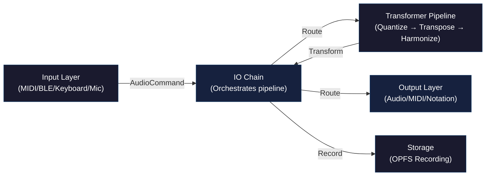
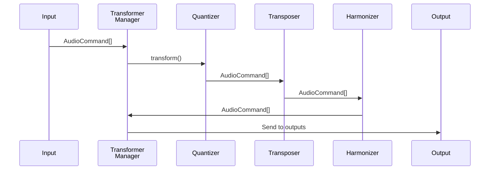
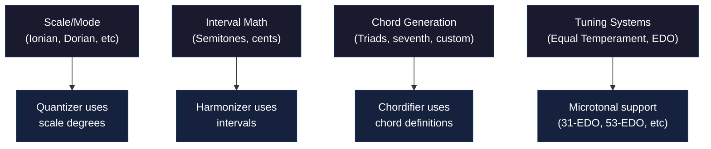

# HarmonEasy

> A web-based music collaboration platform that transforms, quantizes, and harmonizes live MIDI input in real-time

**Tagline:** *Putting the Unity in Community*

## What is HarmonEasy?

HarmonEasy is a modern web application designed for collaborative music-making. It captures MIDI input from multiple sources (keyboards, controllers, Bluetooth devices, even microphones), applies real-time audio transformations, and outputs synchronized, harmonized audio. Whether you're jamming with friends or building complex harmonic arrangements, HarmonEasy enables intuitive musical collaboration without the complexity of traditional DAWs.

**Live Demo:** https://designerzen.github.io/harmoneasy/

## Architecture Overview

HarmonEasy follows a **pipeline architecture** where musical events flow through a chain of transformers before being output to various destinations:



## Core Components

### Input Layer
Captures musical events from various sources and converts them to a unified **AudioCommand** format:

| Input Type | Source | Use Case |
|-----------|--------|----------|
| **WebMIDI** | Hardware MIDI keyboards/controllers | Professional studio gear |
| **Bluetooth MIDI** | BLE-enabled devices | Wireless keyboards, controllers |
| **On-Screen Keyboard** | Computer keyboard or mouse | Quick prototyping |
| **Gamepad** | Game controllers | Novel input method |
| **Microphone** | Audio input with pitch tracking | Voice-driven synthesis |

Each input factory uses lazy-loading for efficient resource management:

```typescript
import { createInputById } from './packages/audiobus/io/input-factory.ts'
import * as INPUT_TYPES from './packages/audiobus/io/inputs/input-types.ts'

const keyboard = await createInputById(INPUT_TYPES.KEYBOARD)
await keyboard.start()
```

### Transformer Pipeline
Processes **AudioCommand** objects through a configurable chain of effects. Each transformer is a pure function that modifies commands before passing them downstream:



**Available Transformers:**
- **Quantizer** - Snap notes to scale degrees
- **Transposer** - Shift pitch by semitones
- **Harmonizer** - Add harmonic voices
- **Chordifier** - Generate chords from single notes
- **Arpeggiator** - Break chords into patterns
- **Note Delay/Repeater** - Add echoes and repetitions
- **Humanizer** - Add swing and timing variations
- **Moodifier** - Emoji-based chord generation
- **Microtonal Transformer** - Support for EDO scales

Transformers run in Web Workers by default for non-blocking processing:

```typescript
import { TransformerManagerWorker } from './packages/audiobus/io/transformer-manager.ts'

const manager = new TransformerManagerWorker()
const transformed = await manager.transform(commands)
```

### Output Layer
Routes processed commands to various destinations:

| Output Type | Destination | Format |
|------------|-------------|--------|
| **Web Audio** | Browser synthesis engine | Polyphonic audio |
| **WAM2** | Web Audio Modules 2 plugins | VST-like plugins |
| **MIDI Output** | External hardware/DAW | MIDI messages |
| **Notation** | Sheet music display | VexFlow rendering |
| **Speech** | Text-to-speech synthesis | Voice output |
| **MusicXML** | Music notation format | File export |
| **Vibrator** | Device haptics | Haptic feedback |

```typescript
import { createOutputById } from './packages/audiobus/io/output-factory.ts'
import * as OUTPUT_TYPES from './packages/audiobus/io/outputs/output-types.ts'

const notationOutput = await createOutputById(OUTPUT_TYPES.NOTATION)
await notationOutput.noteOn(60, 100)  // Middle C
```

### Synchronization Layer
The **Audio Clock** keeps everything in sync using the Web Audio API's high-precision timer:

```typescript
// All commands are timestamped to audio clock
// Ensures perfect timing even with asynchronous processing
command.timestamp = audioContext.currentTime + delayInSeconds
```

## Music Theory Foundation

HarmonEasy integrates deep music theory knowledge through the **pitfalls** package:



Supported scales/modes:
- Major (Ionian)
- Dorian, Phrygian, Lydian, Mixolydian, Aeolian, Locrian
- Harmonic & Melodic Minor
- Blues, Pentatonic, and custom scales
- Microtonal EDO systems (12-EDO, 31-EDO, 53-EDO, etc.)

## Project Structure

```
harmoneasy/
├── packages/                 # Core libraries (npm workspace)
│   ├── audiobus/            # Main audio engine
│   │   ├── instruments/     # Synth & oscillator definitions
│   │   ├── io/              # Input/Output/Transformer management
│   │   ├── midi/            # MIDI protocol implementation
│   │   ├── timing/          # Audio clock & synchronization
│   │   ├── tuning/          # Music theory (scales, chords)
│   │   ├── conversion/      # Note ↔ Frequency conversions
│   │   └── storage/         # OPFS file system interface
│   ├── netronome/           # Audio worklet processor (timing)
│   ├── midi-ble/            # Bluetooth MIDI implementation
│   ├── pitfalls/            # Music theory utilities
│   ├── audiotool/           # AudioTool SDK integration
│   ├── openDAW/             # OpenDAW format support
│   ├── pink-trombone/       # Speech synthesis plugin
│   └── flodjs/              # External library integration
│
├── app/
│   └── harmoneasy/          # Main web application
│       ├── src/
│       │   ├── components/  # React/Web Components
│       │   ├── hooks/       # Custom React hooks
│       │   ├── styles/      # SCSS stylesheets
│       │   ├── ui.ts        # UI controller class
│       │   ├── audio.ts     # Audio engine initialization
│       │   ├── commands.ts  # MIDI command constants
│       │   └── options.ts   # Configuration options
│       └── vite.config.ts
│
└── tests/                   # Integration & E2E tests
```

## Key Concepts

### AudioCommand
The fundamental data structure representing a single musical event:

```typescript
interface IAudioCommand {
  timestamp: number           // Exact time to execute (audio clock)
  command: number             // MIDI status (144=NoteOn, 128=NoteOff, etc)
  channel: number             // MIDI channel (1-16)
  note: number                // MIDI note number (0-127)
  velocity: number            // Velocity (0-127)
  duration?: number           // Optional duration in seconds
  customData?: Record<any, any> // Extended metadata
}
```

### IO Chain
The `IOChain` orchestrates the entire pipeline:

```typescript
const ioChain = new IOChain()

// Connect input → transformers → outputs
ioChain.addInput(midiInput)
ioChain.addTransformer(quantizer)
ioChain.addTransformer(harmonizer)
ioChain.addOutput(webAudioOutput)
ioChain.addOutput(notationOutput)

// Start processing
await ioChain.start()
```

### Factory Pattern
Inputs and Outputs use the factory pattern for efficient resource management:

```typescript
// Inputs are created lazily on-demand
const factory = getAvailableInputFactories()
const keyboards = factory.filter(f => f.type === INPUT_TYPES.KEYBOARD)
const input = await keyboards[0].create()

// Same for outputs
const outputFactories = getAvailableOutputFactories()
const wam2 = await outputFactories.find(f => f.type === OUTPUT_TYPES.WAM2).create()
```

## Technology Stack

| Layer | Technology |
|-------|-----------|
| **Language** | TypeScript 5.9+, ES modules |
| **Frontend** | Vite 5+, Web Components, React |
| **Audio** | Web Audio API, MIDI.js, WAM2 |
| **Styling** | SCSS with CSS variables |
| **Storage** | OPFS (Origin Private File System) |
| **Testing** | Vitest, Web Audio Test Utils |
| **Build** | Turbo monorepo, pnpm workspaces |
| **Desktop** | Electron (optional) |

## Getting Started

### Prerequisites
- Node.js 18.x or higher
- pnpm 8.x or higher
- Modern browser (Chrome 90+, Firefox 88+, Safari 14.1+)

### Installation

```bash
git clone https://github.com/designerzen/harmoneasy.git
cd harmoneasy
pnpm install
pnpm run dev
```

Development server runs on `http://localhost:5174`

### Essential Commands

```bash
pnpm run dev          # Start dev server
pnpm run build        # Production build
pnpm run preview      # Preview production build
pnpm test             # Run all tests
pnpm test -- --watch  # Watch mode
pnpm run lint         # TypeScript & linting
```

## Usage

### Basic Workflow

1. **Load Input** - Select MIDI device, keyboard, or microphone
2. **Configure Scale** - Choose root note and scale/mode
3. **Add Transformers** - Drag quantizer, harmonizer, etc. into pipeline
4. **Play** - Notes automatically quantize and harmonize
5. **Export** - Save as MIDI, MusicXML, or audio

### Example: Creating a Harmonized Arpeggio

```typescript
import { createInputById, createOutputById } from './packages/audiobus/io'
import { IOChain } from './packages/audiobus/io'
import { QuantizerTransformer } from './packages/audiobus/io'
import { ArpeggiatorTransformer } from './packages/audiobus/io'
import * as INPUT_TYPES from './packages/audiobus/io/inputs/input-types'
import * as OUTPUT_TYPES from './packages/audiobus/io/outputs/output-types'

// Create and connect components
const chain = new IOChain()
const midiInput = await createInputById(INPUT_TYPES.WEBMIDI)
const webAudio = await createOutputById(OUTPUT_TYPES.WEB_AUDIO)

// Configure transformers
const quantizer = new QuantizerTransformer({ scale: 'major', root: 60 })
const arpeggiator = new ArpeggiatorTransformer({ pattern: 'up-down' })

// Build pipeline: MIDI → Quantize → Arpeggiate → Web Audio
chain.addInput(midiInput)
chain.addTransformer(quantizer)
chain.addTransformer(arpeggiator)
chain.addOutput(webAudio)

await chain.start()
```

## Features Spotlight

### Real-Time Collaboration
HarmonEasy processes commands synchronously across all outputs, enabling multiple musicians to perform together without timing issues.

### Advanced Export
- **MIDI** - Compatible with all DAWs
- **MusicXML** - For notation software
- **Audio** - Via Web Audio export
- **OpenDAW** - Native project format
- **Markdown** - Textual music notation

### Persistent Sessions
All MIDI events are recorded to browser OPFS, allowing you to:
- Resume sessions across page reloads
- Export complete recordings
- Build session history
- Replay performances

### WAM2 Plugin Support
HarmonEasy can host Web Audio Modules 2 plugins, treating them as outputs:

```typescript
const wam2Output = await createOutputById(OUTPUT_TYPES.WAM2)
// Route MIDI to plugin
await wam2Output.noteOn(60, 127)
await wam2Output.noteOff(60)
```

## Browser Support

| Browser | Min Version | Notes |
|---------|------------|-------|
| **Chrome** | 90+ | Full support including WAM2 |
| **Firefox** | 88+ | Full support |
| **Safari** | 14.1+ | Full support |
| **Edge** | 90+ | Full support |

**Required APIs:**
- Web Audio API (all browsers)
- Web MIDI API (optional, hardware MIDI)
- Web Bluetooth API (optional, BLE MIDI)
- OPFS (optional, persistent storage)

**Not Available:**
- WebMIDI in private/incognito mode
- BLE MIDI requires HTTPS in production

## Development Workflow

### Adding a New Transformer

1. Create class extending `Transformer` base
2. Implement `transform(commands, timer)` method
3. Register in transformer factory
4. Add UI controls for parameters

```typescript
import { Transformer } from './packages/audiobus/io/transformer.ts'
import { IAudioCommand } from './packages/audiobus/types.ts'

export class MyTransformer extends Transformer {
  transform(commands: IAudioCommand[]): Promise<IAudioCommand[]> {
    return Promise.resolve(
      commands.map(cmd => ({
        ...cmd,
        velocity: Math.floor(cmd.velocity * 0.8)  // Example: reduce velocity
      }))
    )
  }
}
```

### Adding a New Input

1. Create class implementing `IAudioInput` interface
2. Implement `start()` and `stop()` methods
3. Emit `command` events with AudioCommand objects
4. Register in input factory

```typescript
import { IAudioInput } from './packages/audiobus/io/types.ts'
import { EventEmitter } from 'events'

export class MyInput extends EventEmitter implements IAudioInput {
  async start() {
    // Initialize hardware/API
  }
  
  async stop() {
    // Cleanup
  }
}
```

### Code Style

- **Imports:** Always use `.ts` or `.js` extensions (ES modules)
- **Types:** Strict TypeScript, explicit types, avoid `any`
- **Naming:** `camelCase` for vars/functions, `PascalCase` for classes/interfaces
- **Comments:** JSDoc for public APIs
- **Error Handling:** Validate at boundaries, trust internal code
- **Testing:** Unit tests required for new features

## Building

### Web Build
```bash
pnpm run build
# Output: dist/
```

### Electron Desktop Build
```bash
pnpm run build:electron
# Output: native/ (platform-specific executables)
```

## Roadmap

- **Collaboration** - Real-time multi-user editing (PartyKit)
- **Cloud** - User accounts, presets, cloud sync
- **Plugins** - More WAM2 plugins, VST/AU wrappers
- **Mobile** - React Native app
- **Performance** - WASM transformers, SIMD optimizations
- **MIDI** - Advanced MIDI learn, controller mapping UI

## Known Limitations

- WebMIDI unavailable in private browsing
- BLE MIDI requires HTTPS in production
- WAM2 plugin support varies by browser
- Some transformers may be computationally expensive

## Contributing

We welcome contributions! Please:

1. Fork the repository
2. Create a feature branch: `git checkout -b feature/amazing-feature`
3. Write tests for new code
4. Commit: `git commit -m 'Add amazing feature'`
5. Push: `git push origin feature/amazing-feature`
6. Open a Pull Request

**Development guidelines:**
- Follow code style rules (see AGENTS.md)
- Write tests using Vitest
- Update documentation
- Ensure tests pass: `pnpm test`

## License

MIT License - see LICENSE file for details.

## Credits

Built with these amazing technologies:

- [Web Audio API](https://www.w3.org/TR/webaudio/) - Audio processing
- [Web MIDI API](https://www.w3.org/TR/webmidi/) - MIDI device support
- [Web Bluetooth API](https://www.w3.org/TR/web-bluetooth/) - Bluetooth MIDI
- [Web Audio Modules 2](https://www.webaudiomodules.org/) - Plugin system
- [VexFlow](https://www.vexflow.com/) - Sheet music rendering
- [Pink Trombone](https://dood.al/pinktrombone/) - Speech synthesis

## Support & Community

- 📝 [Issues](https://github.com/designerzen/harmoneasy/issues) - Bug reports & feature requests
- 💬 [Discussions](https://github.com/designerzen/harmoneasy/discussions) - Questions & ideas
- 📧 [Contact Maintainers](mailto:radio@awesomething.co.uk)

---

**Made with ♪ by the HarmonEasy community**
